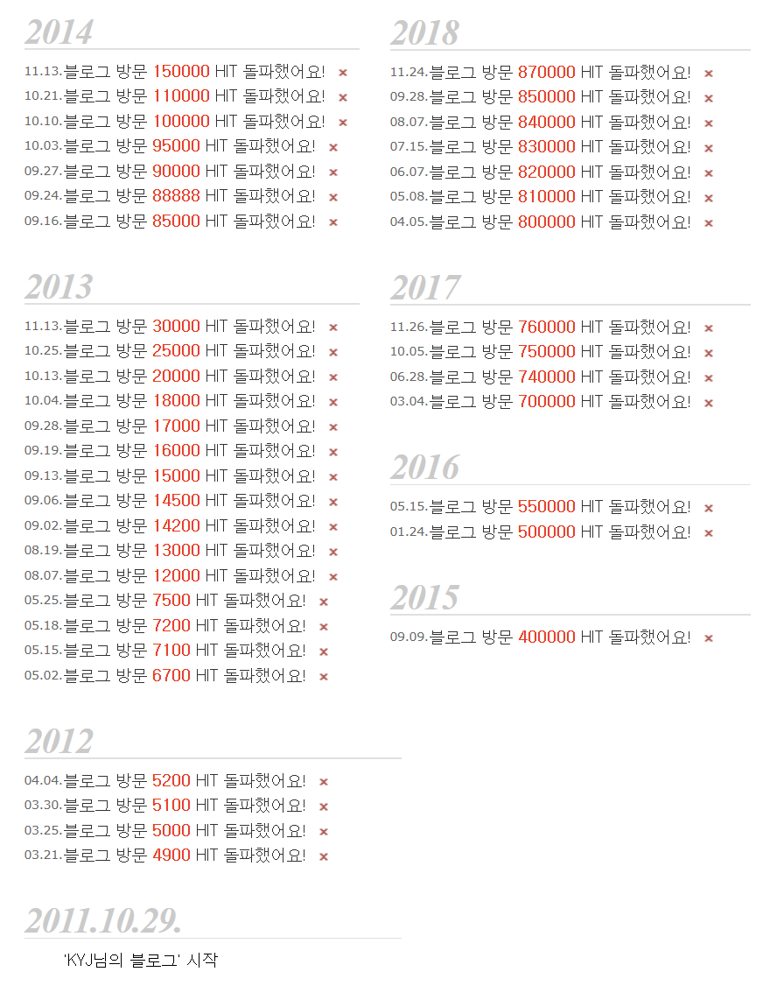
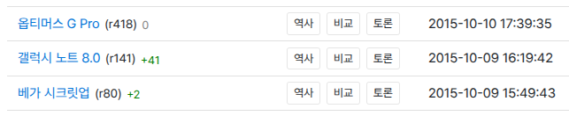
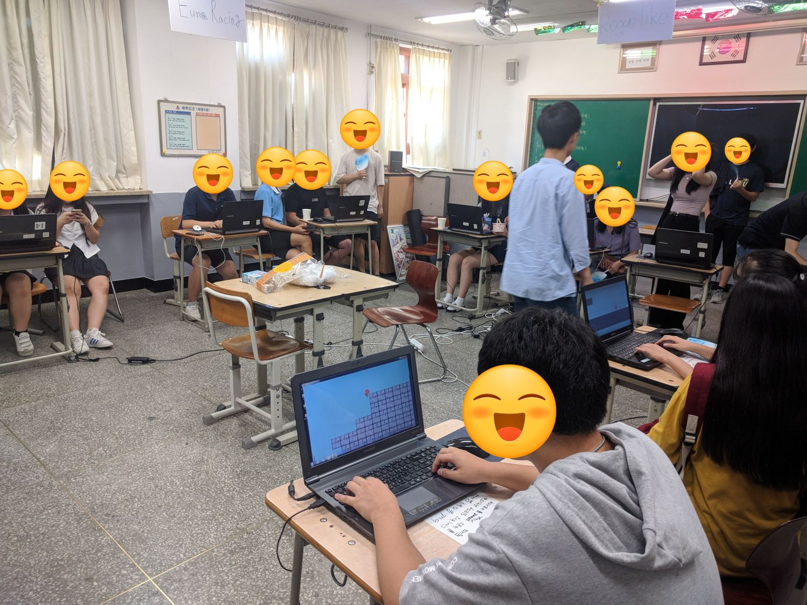
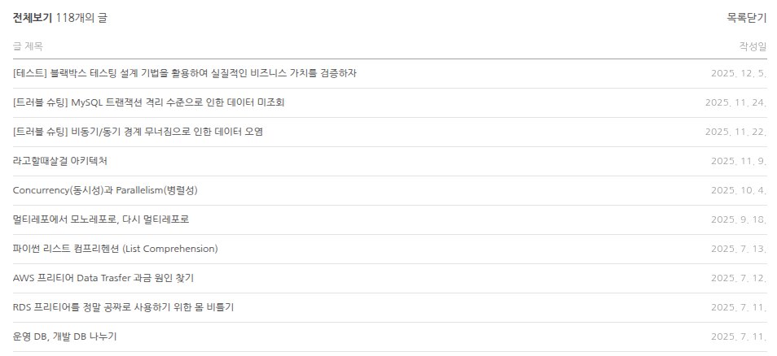

# Detailed Story of [김연재](https://github.com/kyj0503)
## Table of Contents
  * [**1. Introduction**](#1-introduction)
    + [1.1. Profile](#11-profile)
    + [1.2. For a lifetime](#12-for-a-lifetime)
  * [**2. Projects**](#2-projects)
    + [2.1. Personal Project](#21-personal-project)
      - [2.1.1. 라고할때살걸](#211-라고할때살걸)
    + [2.2. Team Projects](#22-team-projects)
      - [2.2.1. Rhythmeet](#221-rhythmeet)
      - [2.2.2. Jandi Web IDE](#222-jandi-web-ide)
      - [2.2.3. Just Plan It!](#223-just-plan-it)
  * [**3. Experiences**](#3-experiences)
    + [3.1. 개발 동아리 GDGoC](#31-개발-동아리-gdgoc)
    + [3.2. 연합 해커톤](#32-연합-해커톤)
    + [3.3. 교내 해커톤](#33-교내-해커톤)
    + [3.4. 개발 동아리 아우내](#34-개발-동아리-아우내)
  * [**4. Educations**](#4-educations)
    + [4.1. 강남대학교 소프트웨어전공](#41-강남대학교-소프트웨어전공)
    + [4.2. 구름톤 DEEP DIVE 풀스택 개발자 과정](#42-구름톤-deep-dive-풀스택-개발자-과정)
    + [4.3. 경남대학교 컴퓨터공학전공](#43-경남대학교-컴퓨터공학전공)


## 1. Introduction
### 1.1. Profile
이름: 김연재

  - 생년월일: 2001-05-03
  - 이메일: heroria0503@gmail.com
  - Github: https://github.com/kyj0503
  - 블로그: https://blog.naver.com/kanden9999

### 1.2. For a lifetime


```
**11살, 첫 서버 운영과 데이터 소실의 교훈**
초등학생 시절, 공유기 접근 권한이 없어 포트포워딩 기능을 사용하지 못해 Hamachi VPN을 이용해 게임 서버를 직접 호스팅했습니다. [블로그](https://blog.naver.com/kanden9999) 이웃 150여 명이 즐기던 인기 서버였으나, 악의적인 유저의 테러로 맵 데이터가 소실되는 사건을 겪었습니다. 그 후 게임 서버 운영은 접었지만 백업의 중요성을 뼈저리게 느꼈고, 중학생 때부터는 **보안과 백업을 최우선으로 고려하는 습관**을 들여 데이터 소실이나 바이러스 감염 사고를 단 한 번도 겪지 않았습니다.
```

```
**15살, 소비자를 넘어 생산자로**
게임을 원활하게 즐기기 위해 용돈을 모아 하드웨어를 조립하며 컴퓨터 구조에 눈을 떴습니다. 단순히 지식을 소비하는 데 그치지 않고, 나무위키에 IT 지식을 기여하며 오픈소스 마인드를 키웠습니다.
```

```
**18살, 개발의 본질적인 즐거움을 발견하다**
교내 게임 개발 동아리에 팀원으로 참가해 Unity 기반의 로그라이크 게임을 제작했습니다. 친구들이 제가 만든 게임을 플레이하며 즐거워하는 모습을 보며, **내 소프트웨어가 누군가에게 가치를 전달할 때 오는 희열**을 처음 맛보았습니다. 이는 훗날 사용자의 피드백을 소중히 여기는 백엔드 개발자가 되는 계기가 되었습니다.
```

```
**24살, '공유하는 개발자'로의 도약**
현재는 [기술 블로그](https://blog.naver.com/kanden9999)를 운영하며 전공 지식과 트러블 슈팅 과정을 기록하고 있습니다. 14년간 이어온 '기록의 습관'은 이제 팀 프로젝트에서 **팀원들과 지식을 공유하고, 문서화를 주도하여 팀 전체의 생산성을 높이는 백엔드 리더십**으로 이어지고 있습니다.
```


## 2. Projects
### 2.1. Personal Project
#### 2.1.1. 라고할때살걸
[웹사이트](https://backtest.yeonjae.kr/) [Github](https://github.com/kyj0503/backtest)

**기간:** 2025. 05. ~ 2025. 11.

**성과:** 강남대학교 컴퓨터공학부 졸업작품전시회 **장려상** 수상

**설명:** 과거 주가 데이터에 투자 전략을 대입해 수익률을 시뮬레이션하는 서비스

* **Architecture & Performance**
    * **FastAPI & Async:** 다양한 매매 전략을 동적으로 실행할 수 있도록 비동기 서버를 설계했습니다.
    * **Caching Strategy:** 데이터 변동 빈도에 따라 TTL을 동적으로 적용하고, 메타데이터 기반 소급 액면분할 감지 로직을 설계해 캐시 효율과 데이터 정합성을 100% 확보했습니다.
    * **Optimization:** 프론트엔드 차트 렌더링 병목 해결을 위해 조회 기간에 따라 데이터를 동적으로 집계하는 다운샘플링 알고리즘을 구현했습니다.
* **Troubleshooting**
    * **Blocking I/O 격리:** 캐시 미스(Cache Miss) 시 발생하는 DB 조회 작업이 이벤트 루프를 차단하지 않도록 별도 스레드 풀로 격리했습니다. [블로그 포스팅](https://blog.naver.com/kanden9999/224084582339)
    * **Connection Pool 관리:** 외부 API 연동 시 간헐적인 "No Data" 오류가 커넥션 문제임을 파악, 데이터 저장 직후 명시적으로 커넥션을 재수립하도록 개선했습니다. [블로그 포스팅](https://blog.naver.com/kanden9999/224086753604)


### 2.2. Team Projects
#### 2.2.1. Rhythmeet
[웹사이트](https://rhythmeet.site/) [Github](https://github.com/kyj0503/jandi_band_backend)

**기간:** 2025. 05. ~ 2025. 06.

**규모:** 가입자 122명 달성

**역할:** Backend Team Lead (FE 3, BE 4)

* **Development:** 공연 홍보, 일정 조율 등 107개 API 중 핵심 API 34개를 설계 및 개발했습니다.
* **Infra & DevOps:** AWS EC2, RDS, S3 환경을 직접 구축하고 **Jenkins** 파이프라인을 설계하여 배포 자동화를 구현했습니다. 단순 Health Check를 넘어 **Prometheus와 Grafana**를 도입, 활성 사용자 수와 API Latency를 시각화하여 장애 대응 체계를 마련했습니다.
* **Management:** 기획 단계에서 기능 요구사항을 기술적으로 분석하여 백로그를 생성하고, 팀원들의 역량에 맞춰 티켓을 분배하며 개발 일정을 조율했습니다.


#### 2.2.2. Jandi Web IDE
[웹사이트](https://jandiide.netlify.app/) [Github](https://github.com/kyj0503/jandi_ide_backend)

**기간:** 2025. 04.

**역할:** Backend Team Lead (FE 2, BE 3)

* **Development:** **Redis Pub/Sub**과 **WebSocket**을 연동해 실시간 채팅을 구현하고, **MongoDB**로 로그를 관리했습니다. REST API의 JWT 인증을 WebSocket 핸드셰이크에도 적용하여 보안을 강화했습니다.
* **Core Logic:** **ProcessBuilder**로 Java/Python/C++ 코드를 실행하되, `waitFor(timeout)` 및 JVM 메모리 옵션(`-Xmx`)을 강제하여 무한 루프 등 악의적 코드로 인한 서버 다운을 원천 차단했습니다.
* **Management:** WebSocket 통신 기능을 팀원 모두가 처음 다뤄본 프로젝트였습니다. 팀원들의 원활한 개발을 위해 가이드 문서를 작성하고 핵심 모듈 개발을 주도하여 리스크를 관리했습니다.


#### 2.2.3. Just Plan It!
[웹사이트](https://justplanit.site/) [Github](https://github.com/kyj0503/jandi_plan_backend)

**기간:** 2025. 02. ~ 2025. 03.

**역할:** Backend Team Lead (FE 2, BE 2)

* **Development:** Spring Security 라이브러리 없이 `RestTemplate`으로 OAuth2 인증 흐름(Code → Token → UserInfo)을 직접 구현하며 소셜 로그인 원리를 깊이 있게 학습했습니다.
* **Infra & DevOps:** **GCP Cloud Run, SQL, Storage** 환경을 구축하고 **Github Actions**를 도입해 CI/CD 파이프라인을 완성했습니다. 프로젝트 시작 3개월 뒤 GCP 프리티어가 끝나, AWS와 Jenkins 환경으로 마이그레이션 했습니다.
* **Resource Management:** 게시글 작성 중 이탈 시 발생하는 GCS 고아 객체(이미지)를 정리하기 위해, 임시 ID와 스케줄러를 활용한 생명주기 관리 로직을 설계했습니다.


## 3. Experiences
### 3.1. 개발 동아리 GDGoC
  * 기간: 2024. 09. ~
  * 이하 해커톤에 2회 참가했습니다.

AWS Student Community Day, GDG DevFest 인천 등 개발자 컨퍼런스 참석 기회가 생기면 최대한 참가해서 시야를 넓히는 것을 좋아합니다.
 

### 3.2. 연합 해커톤
  * **GDGoC KR Hackathon : 백야**
  * 기간: 2025. 01.
  * **Development**: 파일명 충돌 방지를 위한 UUID 난수화 및 Content-Type 자동 감지 로직 적용.

지난 해커톤에서 인프라를 미리 구축해두는 것이 시간 절약에 절대적으로 큰 영향을 준다는 것을 깨닳아, 깃허브에 코드 푸시하면 바로 배포되는 파이프라인을 미리 만들어 갔습니다. 지난 해커톤에서 AWS EC2를 사용했을 때, 해커톤 같이 Time Critical한 상황에서 리눅스를 직접 다루는 것은 너무 번거롭다 판단하여, 코드 푸시만 하면 알아서 이미지 빌드하고 배포까지 해주는 GCP Cloud Run을 사용했습니다. 이를 통해 서버리스 아키텍처를 알게 되었습니다.


### 3.3. 교내 해커톤
  * **강냉톤**
  * 기간: 2025. 01.
  * **Development**: OpenAI API의 비결정적 응답(Hallucination) 제어를 위한 프롬프트 최적화 및 JSON 파싱 전처리 로직 구현.

첫 해커톤을 나가기 전까진 클라우드, CI/CD가 뭔지도 몰랐습니다. 이전까지 팀 프로젝트 과제를 할 때는 각자 작업이 끝나면 각자 테스트하고 나중에 병합하면 그만이었으니까요. 하지만 해커톤을 하면서 약 20시간 안에 4명이 병렬적으로 동시에 작업해야하는 상황에서 이전과 같은 방식은 불가능 했습니다. 프론트엔드가 개발할려면 백엔드 서버가 띄워져 있고, 자유롭게 연결이 가능해야 했습니다. 이때 해당 구조를 어떻게 구현하지? 고민하다 AWS를 알게됐고, EC2 인스턴스를 생성해보며 클라우드를 공부하게 되었습니다. 또한 백엔드에서 코드를 커밋할 때마다 EC2에 SSH로 접근해 JAR 파일을 빌드하는건 너무 번거로웠기 때문에 어떻게 해결할까 고민했고, 이 과정에서 지속적 통합, Github Actions를 알게되어 도입했습니다.


### 3.4. 개발 동아리 아우내
  * 기간: 2024. 03. ~ 2025. 02.
  * **Development**: 위치 기반 서비스의 주소/위도/경도 복합 비교 로직을 도입해 데이터 중복을 방지했습니다.

강남대학교에는 K-프로젝트라고 하는 제도가 있습니다. 학생들이 팀을 꾸려 프로젝트를 제안, 활동하면 심사 후 학점 인정을 해주는 제도입니다. 저는 이 K-프로젝트의 팀장을 담당하여 모각코하기 좋은 장소를 알려주는 서비스를 제작했습니다. 팀 프로젝트를 처음 하는 팀원들에게 Git 워크플로우와 Spring Boot 기초를 교육하며 팀원 전체의 기술 역량을 높이는 데 기여했습니다.


## 4. Educations
### 4.1. 강남대학교 소프트웨어전공
  * 기간: 2024. 03. ~ 현재
  * GPA: 3.76 / 4.5

 
### 4.2. 구름톤 DEEP DIVE 풀스택 개발자 과정
  * 기간: 2024. 11. ~ 2025. 06.
  * **역할**: 잔디 팀 **백엔드 팀장**

프로젝트 기간동안 하루~3일에 한번 스크럼 회의를 통해 진행 상황을 공유하고 회의 내용을 문서화를 했습니다. 또한, 팀원들의 실력에 맞춰 백로그를 세분화하여 분배하고, 매주 코드 리뷰와 병합을 직접 수행하며 코드 품질을 높이고자 노력했습니다.

 
### 4.3. 경남대학교 컴퓨터공학전공
  * 기간: 2020. 03. ~ 2024. 02.
  * GPA: 4.04 / 4.5
  * 2학년 수료 후 강남대학교로 편입했습니다.

